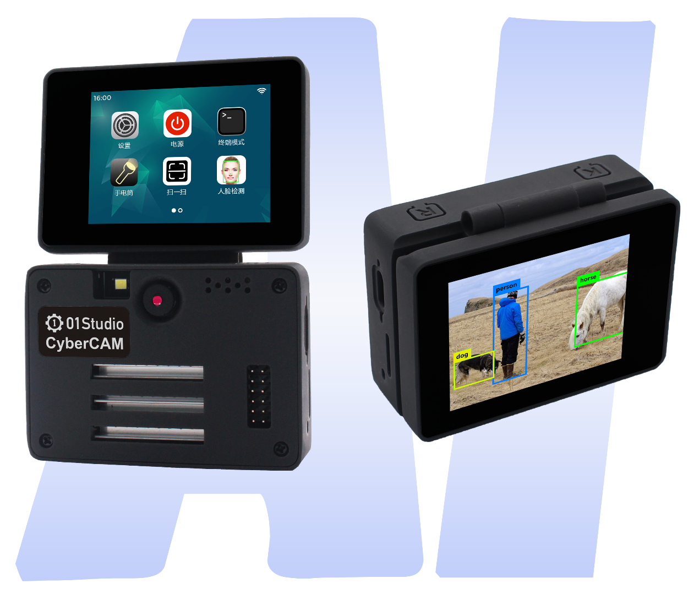
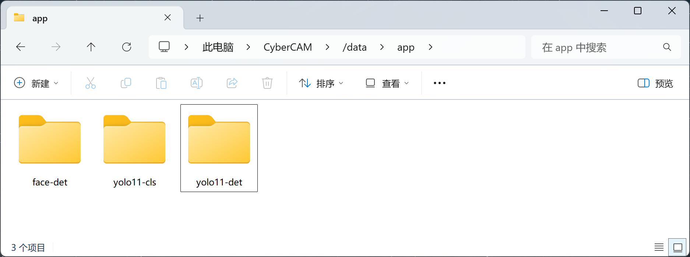
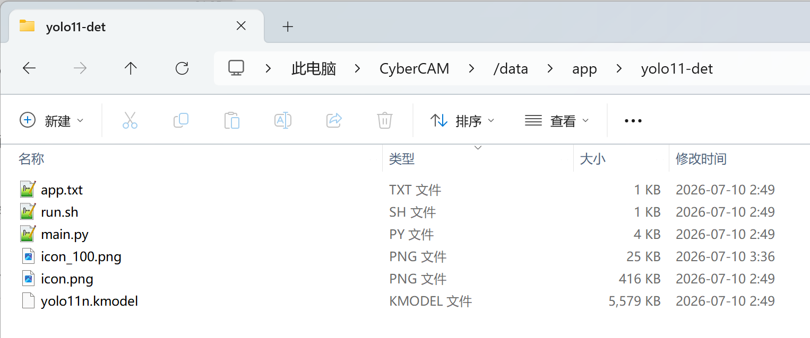

# Apps for CyberCAM

[中文](./README.md) | **English**

CyberCAM Linux system supports custom APPs. Users can quickly deploy their own APPs and display them on the system GUI by uploading relevant code and configuration files according to the specifications.

The APP directory is located at `/data/app` in the CyberCAM file system.

## APP Definition Specification

[Full Tutorial >>](https://wiki.01studio.cc/docs/cybercam/os_software/custom_app)

Take the YOLO11 detection APP as an example. Open the `yolo11-det` folder, the files are as follows:

- `app.txt` : APP information configuration file;
- `run.sh` : Script file to run when executing the APP;
- `main.py` : APP code;
- `yolo11n.kmodel` : Model file called by the code;
- `icon_png` : User-uploaded icon;
- `icon_100.png` : System auto-generated 100x100 pixel icon file.

## APP List

| Category | Directory | Description |
|----------|-----------|-------------|
| AI Vision | `ai-vision` | Machine vision recognition examples. |
| AI Agent | `ai-agent` | Voice dialogue, smart assistant, LLM interactive agent. |
| Desktop Widget | `desktop-widget` | Weather clock, calendar, system monitoring, to-do list and other info-display apps. |
| Smart Home / IoT | `smart-home` | Smart home integration, such as device control panel, scene automation, home environment monitoring. |
| Education | `education` | Flashcards, object recognition, gesture teaching and other edutainment apps. |
| Tools | `tool` | System debugging, sensor display, utility tools. |
| Game | `game` | Motion-sensing games, AR interaction, etc. |
| Industrial Inspection | `industrial` | Defect detection, part counting, assembly line recognition, helmet/uniform detection. |
| Others | `other` | For uncategorized apps, please place them here first. |

### AI Vision (ai-vision)

Machine vision recognition examples.

- Face:
    - Face Detection (5 Landmarks): [face-det](./app/ai-vision/face-det)
- Body:
    - Person Detection: [person-det](./app/ai-vision/person-det)
    - Person Keypoint: [person-keypoint](./app/ai-vision/person-keypoint)
    - Fall Detection: [fall-det](./app/ai-vision/fall-det)
- Hand:
    - Hand Detection: [hand-det](./app/ai-vision/hand-det)
    - Hand Keypoint Detection: [hand-keypoint](./app/ai-vision/hand-keypoint)
    - Hand Keypoint Classification: [hand-keypoint-cls](./app/ai-vision/hand-keypoint-cls)
- Mask Detection: [mask-det](./app/ai-vision/mask-det)
- License Plate Recognition: [license-recg](./app/ai-vision/license-recg)
- OCR (Optical Character Recognition): [ocr](./app/ai-vision/ocr)
- Smoke Detection: [smoke-det](./app/ai-vision/smoke-det)
- Traffic Light Recognition: [traffic-light-recg](./app/ai-vision/traffic-light-recg)
- YOLO11 Detection: [yolo11-det](./app/ai-vision/yolo11-det)
- YOLO11 Classification: [yolo11-cls](./app/ai-vision/yolo11-cls)

### AI Agent (ai-agent)

Voice dialogue, smart assistant, LLM interactive agent.

- XiaoZhi AI: [xiaozhi](./app/ai-agent/xiaozhi/)

### Desktop Widget (desktop-widget)

Weather clock, calendar, system monitoring, to-do list and other info-display apps.

### Smart Home / IoT (smart-home)

Smart home integration, such as device control panel, scene automation, home environment monitoring.

### Education (education)

Flashcards, object recognition, gesture teaching and other edutainment apps.

### Tools (tool)

System debugging, sensor display, utility tools.

- IMU Attitude Indicator: [imu-attitude](./app/tool/imu-attitude/)
- Bluetooth Showcase: [bt-showcase](./app/tool/bt-showcase/)

### Game (game)

Motion-sensing games, AR interaction, etc.

### Industrial Inspection (industrial)

Defect detection, part counting, assembly line recognition, helmet/uniform detection.

### Others (other)

For uncategorized apps, please place them here first.

## Contributing

Contributions are welcome! Please follow these steps:
1. Fork this project;
2. Modify the code locally;
3. Submit a Pull Request.

Please upload your tested APP to the corresponding category directory under `app` and add a `README.md` file inside your APP folder to introduce your APP and its usage.

**For outstanding APPs, we will pre-install them in the CyberCAM system and recommend them in the official documentation. Developers will also receive product or other forms of rewards.**
