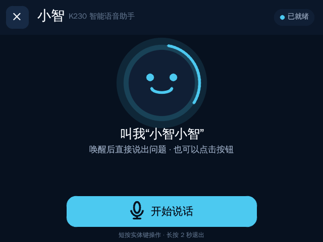
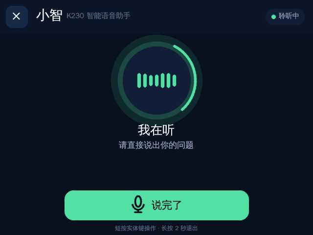
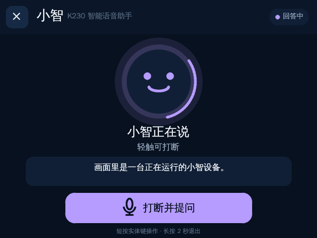

# 小智（CyberCAM K230）

在核桃派 CyberCAM 上运行的小智语音助手。应用使用官方小智 WebSocket 协议，麦克风音频以 16 kHz 单声道、60 ms Opus 帧上传，服务端语音回复实时解码到板载扬声器。

## 效果


| 待机唤醒 | 正在聆听 | 语音回答 |
| --- | --- | --- |
|  |  |  |

## 功能

- 官方 OTA 配置发现和设备激活码（K230 默认使用激活协议 v1）
- 半双工按键对话，避免扬声器回声进入麦克风
- 实时 Opus 编解码，不生成临时录音文件
- STT 文本、回复字幕、情绪和连接状态显示
- 底部大按钮触摸操作、按压反馈与实体键操作
- 麦克风 DC 偏置滤波，改善板载模拟麦克风的底噪
- 录音超时自动提交，断线后一次点击即可恢复并重新聆听
- 无语音 6 秒自动取消，识别或播放连续 15 秒无进展自动回到待机
- 离线语音唤醒：待机时说“你好小智”，音频只在设备本地进行关键词识别；兼容“小智小智”
- 对话结束后保留有效 WebSocket 会话，下一次唤醒无需重复 TLS 和 hello 握手
- 断线时取消旧 MCP/相机任务，下一连接使用独立设备控制会话
- MCP 设备控制：状态、音量、亮度、相机视觉、状态灯和系统信息
- 自包含 RFC 6455 WebSocket 客户端，不需要在设备上 `pip install`
- TLS 证书默认校验；支持私有小智服务器

## 操作

- 待机时说“你好小智”，听到/看到唤醒反馈后直接提出问题
- 点击底部按钮或短按实体 KEY：开始说话
- 再点一次或再短按 KEY：结束录音并等待回答
- 回答过程中点击：打断并开始新问题
- 左上角 `×` 或长按 KEY 2 秒：安全退出

首次使用官方服务时，屏幕会显示六位激活码。登录 [xiaozhi.me](https://xiaozhi.me/) 后添加设备并输入验证码，绑定完成后应用会自动继续。

## 配置

默认配置见 `config.example.json`。应用首次启动不必创建 `config.json`；需要连接自建服务时，在部署目录创建：

```json
{
  "websocket_url": "wss://your-server.example/xiaozhi/v1/",
  "access_token": "your-token",
  "verify_tls": true,
  "input_device": null,
  "output_device": null,
  "max_listen_seconds": 30,
  "no_speech_timeout_seconds": 6,
  "speech_level_threshold": 0.08,
  "response_timeout_seconds": 15,
  "wake_word_enabled": true,
  "wake_word": "你好小智",
  "wake_word_device": "plughw:0,0",
  "wake_word_score": 3.5,
  "wake_word_threshold": 0.1,
  "wake_word_input_gain": 1.8
}
```

`websocket_url` 留空时通过官方 OTA 接口获取地址与短期令牌。`device.json` 在首次启动时生成，保存稳定的 Device-Id 和 Client-Id；部署更新时不要覆盖它。K230 没有官方预置的硬件激活密钥，因此默认使用激活协议 v1。只有设备已经安全预置了服务端认可的 `serial_number` 和 `hmac_key` 时，才应在 `device.json` 中显式设置 `"activation_version": 2`。

只有使用明确受信任的内网自签名服务时才应将 `verify_tls` 设为 `false`。

需要更换“你好小智”、增加多个唤醒词或调整灵敏度时，请参阅[修改离线唤醒词](./WAKE_WORD.md)。修改中文唤醒词不需要重新训练模型或编译设备程序。

## 运行环境

- Python 3.13
- `sounddevice` / PortAudio
- ALSA 输入输出设备
- 系统 `libopus.so.0`
- OpenCV、walnutpi 显示与 GPIO 库

真机目录：`/data/app/xiaozhi`

离线唤醒所需的 K230 `riscv64` 常驻服务、sherpa-onnx v1.13.2 SpaceMi 运行库和中文 INT8 KWS 模型均已随 App 内置。将整个 `app/xiaozhi` 目录复制到设备即可运行，不需要在设备上下载资源、安装依赖或现场编译。模型只在 App 启动时预热一次。

在仓库根目录可通过一条命令自动部署；脚本会压缩传输、在设备端校验全部内置资源，并保留已有的 `device.json` 和 `config.json`：

```sh
./app/xiaozhi/deploy.sh 10.10.11.213
```

如果设备地址改变，将参数替换为新的 IP。部署前需要先退出正在运行的小智。`run.sh` 启动时还会检查内置资源并自动修复可执行权限。

## 隐私

启用语音唤醒后，待机麦克风会持续工作，但唤醒词识别完全在设备本地完成，不保存也不上传待机音频。只有屏幕显示“我在听”后，问题语音才会发送到配置的小智服务端完成 ASR、LLM 和 TTS；服务端的数据处理规则取决于所使用的服务。将 `wake_word_enabled` 设为 `false` 可关闭待机麦克风。
