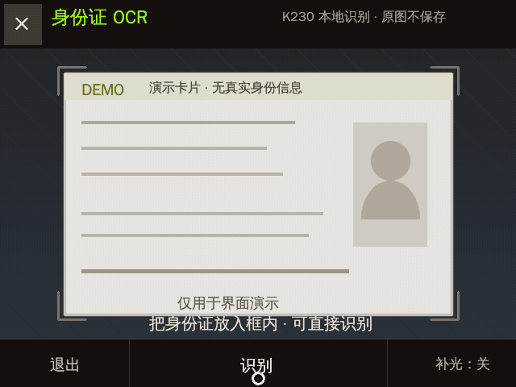
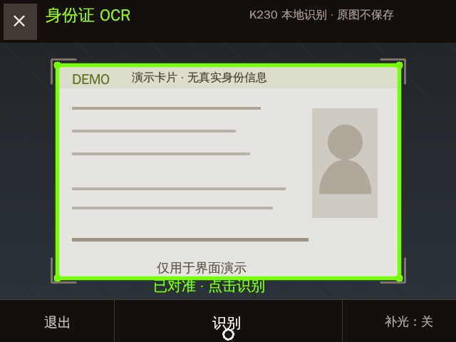
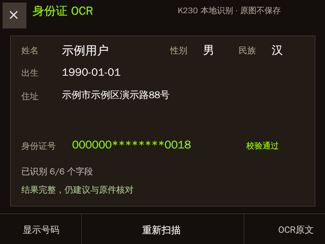
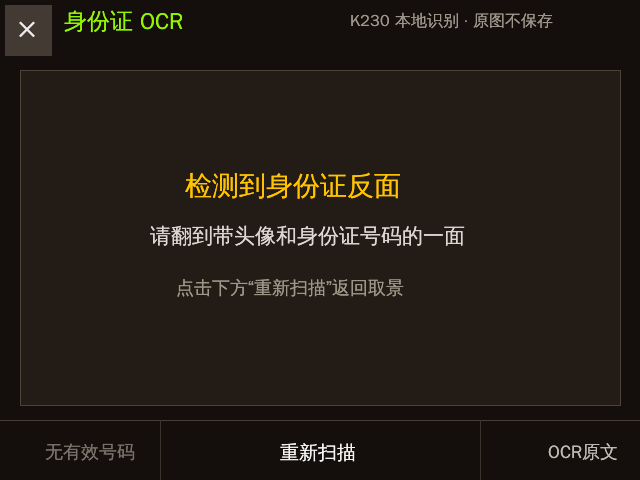

# 身份证 OCR（K230）

CyberCAM 上的离线身份证正面识别应用。利用 OpenCV 在取景阶段检测身份证四边，
稳定后做透视矫正，再调用 K230 KPU 上的文字检测与识别模型，解析出：

- 姓名、性别、民族
- 出生日期、住址
- 公民身份号码（含 GB 11643 校验，并可从号码回填出生日期和性别）

## 效果

> 下列画面由应用真实 UI 在 K230 上渲染，证件和字段均为合成演示数据，
> 不包含真实个人信息。



| 对准取景 | 脱敏结果 | 反面提示 |
| --- | --- | --- |
|  |  |  |

## 交互

- 把身份证正面横向放入取景框，出现绿色边框后点击画面、底部“识别”，或短按实体键。应用会从最近三帧中选择最清晰的一张；检测到模糊、反光或曝光异常时会先提示重拍，再次点击仍可强制继续。
- 补光灯默认关闭；取景页右下角可手动开关，识别完成或退出时自动关闭。
- 结果页默认遮住身份证号；左下角可显示/隐藏，右下角可切换字段/OCR 原文。
- 结果按“可靠、部分、反面、不可靠”分级；反面或不可靠结果不会伪装成识别成功，会直接提示翻面或重拍。
- 点击“重新扫描”或在结果页短按实体键返回取景。
- 点击左上角或底部“退出”；长按实体键 2 秒也可回桌面。

## 隐私设计

- 全部识别在本机执行，不上传网络。
- 透视后的完整证件图仅在内存中短暂存在，识别后立即释放。
- 默认不保存原图、不保存识别结果，也不把 OCR 内容打印到日志。
- 身份证号默认脱敏显示。结果仍需由用户与原件人工核对。

## 算法管线

1. Canny + 轮廓近似检测四边形，并以 ID-1 标准卡片比例筛选；浅色背景没有闭合边缘时，使用 Lab 黄蓝色差、矩形填充率和卡片比例做第二路检测，最后才退回标准取景框。
2. 四角低通与 350 ms 稳定门控，避免手抖时误触发；点击后对最近三帧分别矫正，以清晰度、曝光、对比度和高光比例选择最佳帧。
3. 主画布确定证件方向和基础字段后，再用专用放大画布精读民族单字与多行地址，并按字段可信度合并结果；民族仍为空时，才追加值区紧裁、反锐化和全画布放大重试。
4. 透视变换到 640 × 404 横向标准画布；低质量画面先提示重拍，但允许用户再次点击继续。
5. 只裁取姓名、性别、民族、出生、地址和身份证号 ROI，压平光照、增强笔画后拼成一张干净画布；固定标签、头像与防伪图案不进入 OCR。
6. K230 `kpu.OCR` 对每个候选方向的 ROI 画布执行一次 DBNet 风格文字检测及文字识别，并按画布分区映射字段；号码未通过校验时自动尝试旋转 180°，合法号码优先于字段数和通用置信度。
7. 使用身份证校验位、出生日期和性别交叉核对识别结果，并结合背面关键词将结论分为可靠、部分、反面和不可靠四级。

相机与 KPU 会分时使用 K230 的 CMA 连续内存：识别前释放摄像头，结果页不占
摄像头；重新扫描时先卸载 OCR 再恢复取景，避免 nncase 因 CMA 不足崩溃。
卸载 OCR 时会显式停止 `walnutpi.kpu.OCR` 的后台线程，再按顺序释放检测和
识别模型的 Interpreter/AI2D；仅依赖对象析构会因线程强引用环而泄漏 CMA。
结果页只在内容或提示变化时重绘，避免静止页面持续分配画布；触摸事件队列有
固定上限，识别和页面切换期间的旧手势会被丢弃；退出时会等待输入线程关闭
文件描述符并释放 GPIO 对象。模型和字典使用已知完整文件大小校验，中断上传
留下的残片不会遮蔽系统共享模型。

## 文件

- `main.py`：硬件接入、KPU OCR、状态机和 UI
- `vision.py`：卡片检测、点排序与透视矫正
- `core.py`：字段解析、号码校验、稳定门控与触摸映射
- `ocr_det_int16.kmodel` / `ocr_rec_int16.kmodel` / `dict.txt`：离线 OCR 模型与字典
- `demo.gif` / `preview.png` / `result.png` / `back-side.png`：隐私安全的 README 演示素材
- `tests/render_demo_assets.py`：在 K230 上用真实 UI 重新生成演示素材
- `tests/`：可在开发机或真机执行的逻辑/视觉测试

## 测试

```bash
python3 -m unittest discover -s tests -v
```

部署到 `/data/app/id-card-ocr/` 后，系统桌面会显示“身份证OCR”。
若应用目录没有完整模型，会自动复用系统 `/data/app/ocr/` 中的同款离线模型。
