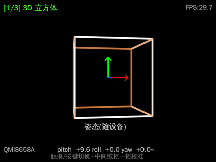
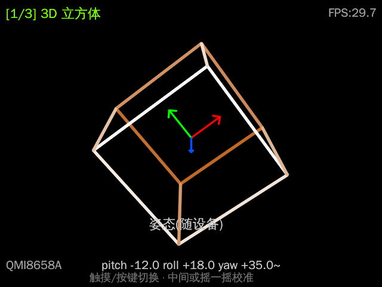
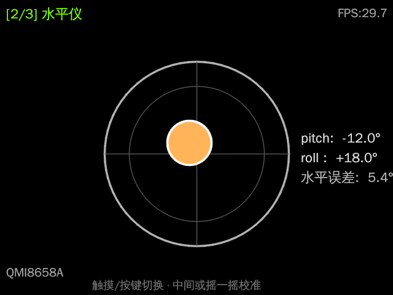
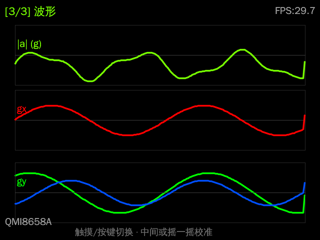

# IMU 姿态仪 (IMU Attitude)

CyberCAM 上第一个基于 IMU 的 APP。读取板载 **QMI8658A(6 轴:三轴加速度 + 三轴陀螺仪)**,
在 640×480 触摸屏上做实时姿态可视化,支持触摸 / 按键 / 摇一摇交互。

> 为什么不用系统自带的 IMU?
> CyberCAM 系统只驱动了另一颗 **QMA6100P(仅三轴加速度)**,用来做屏幕方向;
> 而 wiki 规格里那颗带陀螺仪的 **QMI8658A 一直空闲、没有内核驱动**。
> 本 APP 用纯 Python(标准库)直接经 I2C(bus1/0x6a)驱动 QMI8658A,把 6 轴全用上。
> 当 I2C 不可用时(如权限受限),自动退回 QMA6100P 仅加速度模式。

## 效果



| 3D 立方体 | 水平仪 | 波形 |
| --- | --- | --- |
|  |  |  |

## 三种模式

| 模式 | 内容 |
| --- | --- |
| 1️⃣ 3D 立方体 | 立方体随设备姿态实时转动(加速度+陀螺仪互补滤波),附 pitch/roll/yaw |
| 2️⃣ 水平仪 | 气泡倾角仪,pitch/roll/水平误差,接近水平时变绿并蜂鸣 |
| 3️⃣ 波形 | \|a\| 与陀螺仪 gx/gy/gz 的滚动波形 |

## 交互

- **触摸屏**:点左 1/3 → 上一模式;右 1/3 → 下一模式;中间 → 重新校准
- **板载按键 (KEY)**:切换下一模式
- **摇一摇**:`|a|` 突变 → 重新校准陀螺仪零偏(蜂鸣提示)

## 文件

- `qmi8658.py` — QMI8658A 纯 Python I2C 驱动 + QMA6100P fallback + 陀螺仪零偏校准
- `main.py` — 互补滤波、三种渲染模式、输入、主循环
- `app.txt` / `run.sh` — APP 配置与启动脚本

## 部署

把本目录拷到 CyberCAM 的 `/data/app/imu-attitude/` 即可在系统 GUI 的 APP 列表里看到图标。
调试时可 SSH 进去单独运行:

```bash
cd /data/app/imu-attitude && python main.py    # Ctrl-C 退出
```

## 说明

- yaw 没有磁力计会缓慢漂移,UI 标注"近似(~)"。
- 用互补滤波(非卡尔曼),算力开销低、足够稳定。
- 依赖:CyberCAM 系统自带的 `walnutpi` / `Display` / `cv2`(freetype) / `board`+`digitalio`,无需额外安装。
